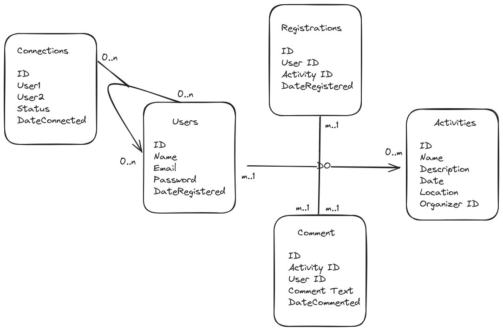

# Design Document - "Interact"

By PolyannaMeira

## Scope

On average, people spend 4 to 5 hours a day using their cell phone. Excessive use of smartphones can reduce the 
quality of personal interactions and negatively affect mental health. 
We need a platform that promotes in-person social activities, encouraging people to disconnect from their devices 
and connect with each other.

Goals:
Promote in-person activities: Organize events, meetings and group activities.
Foster interpersonal communication: Encourage face-to-face conversations and interactions.
Create a sense of community: Bring together people with common interests.

The database for the Interact includes all entities necessary to facilitate the people to find people with similar 
interests and do activities together. As such, included in the database's scope is:

* Users, including basic identifying information;
* Activities, including description, dates, location;
* Registration, including data e places;
* Comments from the user about the activities.

## Functional Requirements

This database will support:

1- Register and Manage Profile:
  * Create a user account with basic information (name, email, password);
  * Update profile information (name, photo, interests).
    
2-  Search and View Activities:
  * Search for activities based on location, date, or interests;
  * View details of activities, including descriptions, times, locations, and organizers.

3- Sign Up for Activities:
  * Register to participate in activities;
  * Receive confirmations and reminders about registrations.
    
4- Create and Manage Activities:
  * Create new activities, providing details such as name, description, date, location, and capacity;
  * Edit or cancel activities they have created.

 5- Interact with Other Users:
  * Conect with other users;
  * Leave comments on activities;
  * View and respond to comments from other users;
  * Rate activities after participation.

### Entities and Relationships

The below entity relationship diagram describes the relationships among the entities in the database.

As detailed by the diagram:

User:
A user can connect with other users or none(0-to-many with itself through Connections).
A user can create multiple activities or none (0-to-many relationship with Activities);
A user can register for multiple activities or none (0-to-many relationship with Activities through Registrations);
A user can comment on multiple activities (0-to-many relationship with Comments).

Activities:
An activity is organized by one user (many-to-one relationship with Users);
An activity can have many registrations (many-to-many relationship with Users through Registrations);
An activity can have many comments or none(0-to-many relationship with Comments);

Registrations:
A registration links a user to an activity (many-to-one relationship with Users and Activities).

Comments:
A comment is made by one user (many-to-one relationship with Users).
A comment is associated with one activity (many-to-one relationship with Activities).

Connections:
Links two users (many-to-many with Users).

## Representation

Entities are captured in MySQL tables with the following schema.

### Tables

The database includes the following tables:

#### Users

`ID` which specifies the unique ID for the Users as an `INTEGER`. This column thus has the `PRIMARY KEY` constraint applied.
`Name` which specifies the user's name as `VARCHAR(255)`.
`Email` which specifies the user's email as `VARCHAR(255)`.
`Password` which specifies the user's password as `VARCHAR(10)`.
`DateRegistered` which specifies the user's DateRegistered. The default value for the `DateRegistered` attribute is the current date, 
as denoted by `DEFAULT (CURRENT_DATE)` statement.

#### Activities 

`ID` which specifies the unique ID for the `Activities` as an `INTEGER`. This column thus has the `PRIMARY KEY` constraint applied.
`Name` which specifies the activities's name as `VARCHAR(255)`.
`Description` which describes de activities.
`Date` which specifies the activities's Date. The default value for the `Date` attribute is the current date, 
as denoted by `DEFAULT (CURRENT_DATE)` statement.
`Location` which specifies the location's activities as `VARCHAR(400)`.
`OrganizerID` which specifies who the organizer is, as an `Integer`. (Foreign Key referencing Users.UserID)

#### Registrations

`ID` which specifies the unique ID for the `Registrations` as an `INTEGER`. This column thus has the `PRIMARY KEY` constraint applied.
`UserID` which is the ID of the user is registered, as an `Integer`(Foreign Key referencing Users.UserID)
`ActivityID` which is the ID of the activity, as an Ìnteger`(Foreign Key referencing Activities.ActivityID)
`DateRegistered` which specifies the registration's Date. The default value for the `DateRegistered` attribute is the current date, 
as denoted by `DEFAULT (CURRENT_DATE)` statement.

#### Comments

`ID` which specifies the unique ID for the `Comments` as an `INTEGER`. This column thus has the `PRIMARY KEY` constraint applied.
`ActivityID` which is the ID of the activity, as an `Integer` (Foreign Key referencing Activities.ActivityID).
`UserID` which is the ID of the user who commented, as an `Integer`(Foreign Key referencing Users.UserID)
`CommentText` which contains the contents of the columns as `TEXT`, given that `TEXT` can still store long-form text.
`DateCommented` which specifies the registration's Date. The default value for the `DateCommented` attribute is the current date, 
as denoted by `DEFAULT (CURRENT_DATE)` statement.

#### Connections

`ID` which specifies the unique ID for the `Connections` as an `INTEGER`. This column thus has the `PRIMARY KEY` constraint applied.
`UserID1` which is the ID of the first user (Foreign Key referencing Users.UserID)
`UserID2` which is the ID of the second user( Foreign Key referencing Users.UserID)
`Status` which is 'pending', 'accepted', 'rejected', as VARCHAR (50).
`DateConnected` which specifies the connected's Date. The default value for the `DateConnected` attribute is the current date, 
as denoted by `DEFAULT (CURRENT_DATE)` statement.

## Optimizations

In this section you should answer the following questions:

* Which optimizations (e.g., indexes, views) did you create? Why?
    * Strive to have at least one index and one view

## Limitations

In this section you should answer the following questions:

* What are the limitations of your design?
* What might your database not be able to represent very well?
